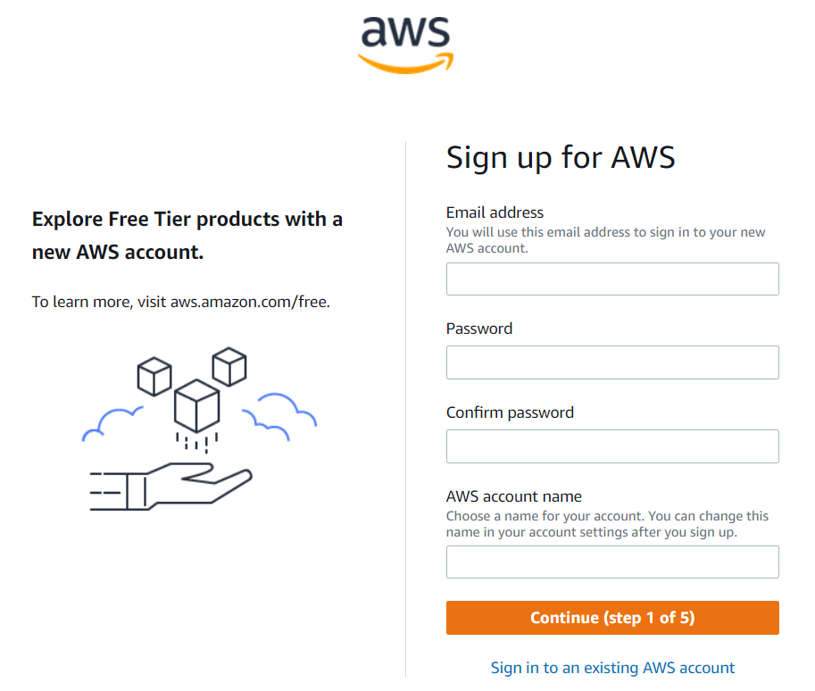
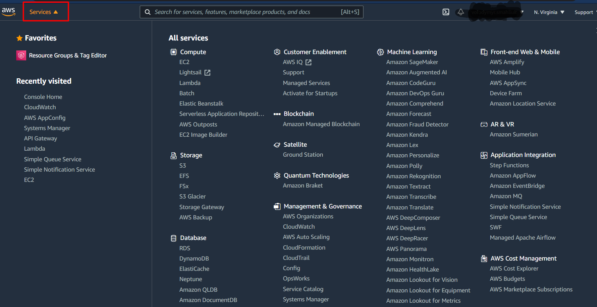
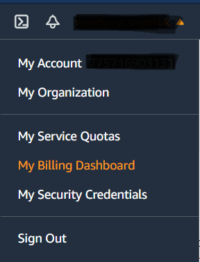
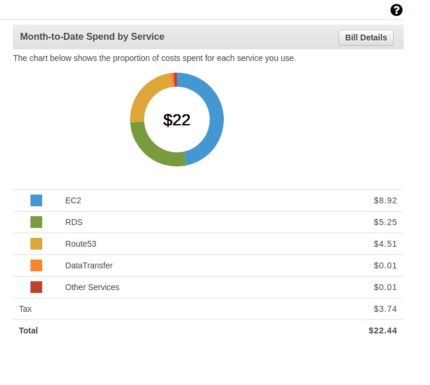
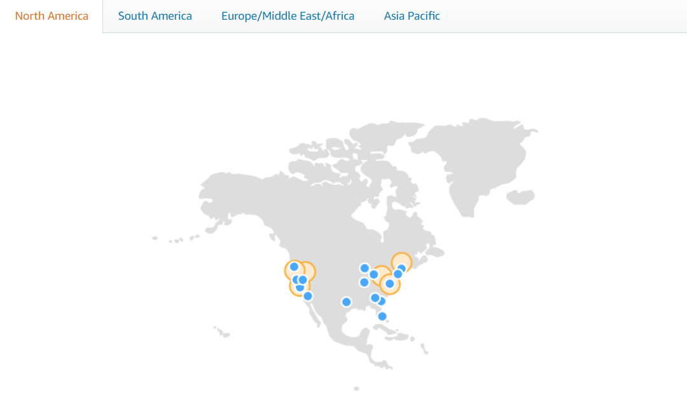
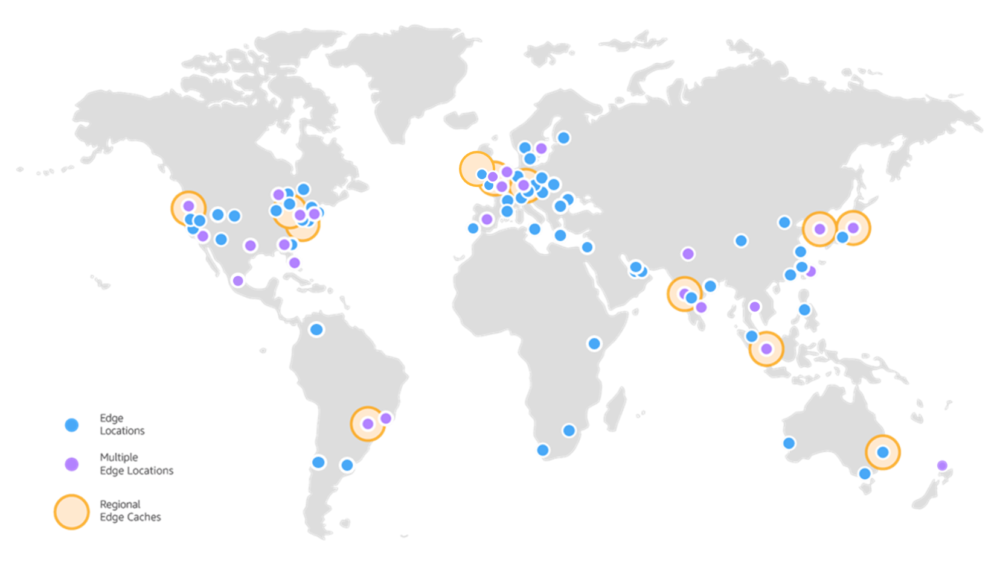

## How to Get the Most of Practical AWS

During this course, we are going to discover different concepts, features, and services from the
AWS cloud. Whether you are a beginner or already know something about AWS , the course will guide you
step by step.

It is normal that some notions at the beginning will be blurred, but I advise you to read on,
because some concepts are first used, then explained in detail. During your learning path, take
notes of the important concepts you learn and the new things you discover.

The knowledge you will acquire during this course is rather practical, but there are the theoretical
background definitions necessary to understand the essentials. If you want to dive into more
theoretical details, the [official AWS documentation](https://docs.aws.amazon.com/) will be a good companion to this course.

This course is a practical way to get quick owerview of Amazon Web Serives (AWS) and apply your knowledge
to create your own systems using with cloud provider.

# Lab 1 - Introduction to Cloud

# Computing

## The Cloud is Just Another Name for the Internet

Cloud Computing is the on-demand delivery of IT resources like computing, applications, and
databases via the Internet. It offers storing and accessing IT resources, data, applications, and
configurations over the Internet.

Tools like Google Drive, Dropbox, and other Software as Service tools are also considered as
cloud technologies, but what interests us in this course are public cloud providers like Google
Cloud Platform, Microsoft Azure, and Amazon Web Services.

In order to remove possible confusion and misapprehension, we are going to define some cloud
computing models.

## Software as a Service - SaaS

SaaS providers like Dropbox use the web to deliver their applications and online tools. Most SaaS
run using a web interface. While the software runs on the server-side, usually, the SaaS user
doesn't need to download any third-party client. Some known SaaS is customer relationship
management (CRM) like Zoho or Salesforce, document management tools like Google Drive or
Microsoft Office 365, enterprise resource planning (ERP) lie Sage.

## Platform as a Service - PaaS

PaaS providers like Heroku, allow customers to develop, build and run applications without
needing to maintain infrastructure or buy a software license. It allows developers to use on-
demand infrastructure without the need for being an infrastructure expert. With the ease of
manipulating PaaS, customers could find themselves in vendor lock-in. Heroku, AWS Elastic
Beanstalk and Google App Engine are PaaS providers.

## Infrastructure as a Service - IaaS

In the IaaS model, the vendor manages the Data Center, Networking, Storage, Virtualization, and
a part of the Operating System (OS). On the other hand, the customer manages an important
part of the OS, the middleware part if it exists and the application. Amazon EC2 is a common IaaS
example: When you enroll an EC2 virtual machine, you do not need to worry about the hardware,
the network, or provisioning the machine with an operating system. You'll just need to install
your middleware and run your application.

## DaaS, CaaS, and other XaaS

You may find other XaaS variants like CaaS (Containers as a Service), DaaS (Database as a
Service), and other XaaS. Most of these fall somewhere between SaaS, PaaS, and IaaS. So, for
example, CaaS is a platform that allows the developer to have access to managed containers, in
reality, instead of a VM, the cloud provider gives you managed VMs that are invisible to you, that
runs containers. This is a subset of IaaS, with the container being a basic resource instead of the
VM.


Most of these names were not created to achieve a technical definition but a marketing purpose.

## A Quick Introduction to AWS

Amazon Web Services is mainly an IaaS provider but has some IaaS services. 
AWS is held by Amazon.com, and it is one of the leading cloud computing
providers. Probably one of the most known services that AWS offers is EC2, but there are tens of
other services: VPC, SES, SQS, S3, CloudFront .. etc.

In the next step, we are going to create an AWS account, but let's see how to get the best out of
AWS services without spending money. This is possible using the AWS Free Tier. This tier includes
offers that expire 12 months following sign up and others that never expire.

e.g., When creating EC2 machines, [AWS Free Tier](https://docs.aws.amazon.com/awsaccountbilling/latest/aboutv2/billing-free-tier.html) includes 750 hours per month of Linux, RHEL, or
SLES t2.micro instance usage and 750 hours per month of Windows t2.micro instance usage.

To see full list of AWS Free Tier follow the [link](https://aws.amazon.com/ru/free/).

## Creating your AWS Account

To start learning, you'll need an account. Go to [AWS website](https://aws.amazon.com/ru/free/) then create an account using your
email. You probably will need to write down your personal information, so go on, because it's required steps.



## AWS Console

AWS console is a web-based management tool that allows users to access and manage AWS
resources. After creating an account, log in using the console URL: aws.amazon.com.

Click on "Services" in order to view the different services that AWS offers.



In order to access your billing dashboard, click on your name on the top right corner of the
screen, then click on "My Billing Dashboard".




AWS has a pay-as-you-go model, so you'll be charged only for what you use. This is why, unlike
traditional computing services, there are no installation or termination fees.

This does not mean that AWS or cloud computing, in general, is cheaper than traditional
computing.

You may pay more in some cases. Cloud computing is neither cheaper nor more expensive than
X or Y solution. This is not a good question to ask.

```
For every complex problem there is an answer that is clear, simple, and wrong. ~ H. L.
Mencken
```
The question here is whether you need the power of cloud computing and everything that comes
with like IaaC (Infrastructure as a Code) or not.

If yes, the best question to ask here is what are the best practices to reduce my costs. If you are
changing your infrastructure and using cloud infrastructure instead, but without changing your
production and management models, you will certainly spend more than a cloud-ready
application/team.

Let's get back to our main topic.

You can follow the usage of resources and the costs allocated to each service separately.



Using the same menu, you can access your account, organization, service quotas, orders and
invoices, and your security credentials. Other useful links like "Support Center" and
"Documentation" are available when you click on "Support".

## AWS Regions

Let's imagine a scenario: You run an application for your customers based in China and Canada
while your servers are installed in the UK. Even if your application is fast, you can not have
control over the transport of your data packets. Customers from both countries will have delays
in sending ingoing and receiving outgoing requests.


Cloud providers generally and AWS specifically offers the possibility of using physical resources in
different data centers in the world. These are called regions.

## Region Maps and Edge Networks


_source aws.amazon.com_

The orange points on the map are regions.

Most of AWS services can be used from [different regions of the world](https://aws.amazon.com/about-aws/global-infrastructure/regions_az). Each service has a regional endpoint.



You can check the long list of regions [here](https://docs.aws.amazon.com/AWSEC2/latest/UserGuide/using-regions-availability-zones.html).

You can't access additional regions from an AWS account, such as AWS GovCloud (only US-West is
available) or the China regions (only Chinese regions like Beijing and Ningxia are available).

Other regional endpoints are available for other services.

e.g. DynamoDB endpoint for Oregon (us-west-2) region is "https://dynamodb.us-west-2.amazona
ws.com"

If a service supports regions, the resources in each region are independent: For example, if you
create an Amazon EC2 instance or an Amazon SQS queue in one region, the instance or queue is
totally independent of instances or queues in another region. You can't use the resources of one
region in another one.

## AWS Availability Zones

A region is made out of zones.

We have seen that AWS has regions and that each region is completely independent.

This is not the case for zones. A zone is isolated but still have a through low-latency link with
other zones in the same region. To build an efficient infrastructure for your customers in a given
region, having your application running in multiple AZs (availability zones) is a good practice. Your
infrastructure has backups of computing, storage, and other types of resources in other AZs.

When a problem occurs in an AZ, other AZs will support the continuity of your production.

For example, "us-east-1" region has 3 AZs:

```
us-east-1a
us-east-1b
us-east-1c
```
## AWS Edges

Some services like AWS CloudFront use edge locations instead of zones and regions.

CloudFront is the CDN of Amazon Web Services with advanced features like authentication and
programmatic access.

Amazon CloudFront has a global edge network of more than 200 points of presence in more than
80 cities. Some of these edges are considered as "edge locations", and others are considered as
"regional edge caches".

Cache edges are a way to accelerate delivering content using CloudFront and reduce the
workload on origins to help you increase the availability of your applications.



_source: aws.amazon.com_
