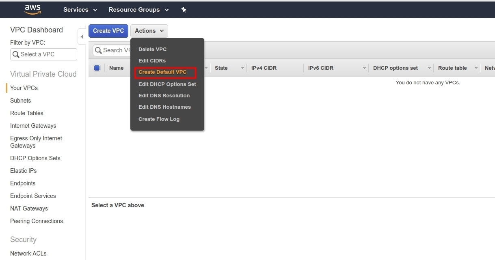
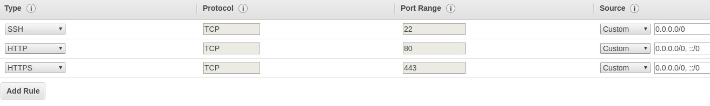

# Lab 2 - Create your First EC2 Virtual Machine

## What is a Virtual Machine?

Let's say you have a computer with a good hardware configuration: (e.g., 16GB DDR3, SSD drives,
and a very good ). You want to use this machine as a server, so you connect it to the Internet, you
already have a static IP address, and you will host your customer small business' websites using
the LAMP stack (Linux, Apache, MySQL, PHP).

This server, with its actual configuration (16GB DDR3 memory ..etc.), could probably host
hundreds if not thousands of small websites; you can actually use it for many customers.
However, each customer would love to have an isolated environment with his own LAMP (Linux operating system, 
Apache web server, MySQL database and PHP) stack, files, and configurations. 
This is when virtualization helps in the pooling of physical resources.

Virtualization is a way to partitioning one physical server into several virtual servers, or machines.
These machines are called guests and will share the same hardware as the host server.

Every virtual machine acts like a "normal" machine; it can be accessed separately, it can have an
IP address ..etc.

Using a hypervisor, a system engineer could create multiple machines using a single physical one.


- VMware Workstation
- VMware Player
- VirtualBox
- Parallels Desktop for Mac, 
- QEM, 
- Xen, 
- Oracle VM Server for SPARC, 
- Oracle VM Server for x86,
- Microsoft Hyper-V
- VMware ESX/ESXi

All of the above are examples of hypervisor technologies used in the IT industry. Virtualization
saves money and resources and makes software installation and system administration easier..
and if you care about the environment, it can be considered an eco-friendly technology.

## Virtualization in AWS

AWS has data centers around the globe, working together to deliver a global cloud computing
service. The data centers are no more than physical machines. To create VMs, Amazon uses Xen
virtualization technology.

To quote the AWS Security Whitepaper, Amazon EC2 currently utilizes a highly customized version
of the Xen hypervisor, taking advantage of paravirtualization (in the case of Linux guests).

Amazon Machine Images (AMI) has two virtualization types; HVM and PV.

HVM is for "Hardware Virtual Machine", and PV is for "Paravirtualization".


HVM is a full virtualization type, which means that all VMs running on top of the hypervisors are
not aware that they are sharing the same hardware.

Paravirtualization, on the other hand, is lighter than HVM. In the case of paravirtualization, the
guest machine requires modifications to run properly.

Traditionally, HVM guests had to translate I/O instructions to emulated hardware, which create
another overhead.

Historically, PV guests had better performance than HVM guests and performed better with
storage and network operations than HVM guests because they could leverage special drivers for
I/O. This is no longer true. HVM virtualization has seen many enhancements, such as the
availability of PV drivers for HVM AMIs (Amazon Machine Images).

So, Amazon Machine Image (AMI), which are the images that provide the information required to
launch a virtual machine on AWS cloud, can use either HVM or PV. When creating a virtual
machine on AWS, I recommend using HVM machines even if you can find some PV AMIs.


## Creating Virtual Machines Using AWS EC2 Console

EC2 or Elastic Compute Cloud is the commercial name for the virtual machine you can use in AWS
cloud service. We are going to create a machine using the web console.

Our goal is to create a web server using NGINX. This is a quick start; some concepts will be
detailed in the next sections. You need to go to aws.amazon.com and type your login and
password or create a new account if it is not already done.


For the sake of simplicity, I will be using the AWS default VPC. We are going to learn more about
VPC in this course. If you already deleted it, you can restore it by going to your VPC configuration,
then create a new one:



You can find the link to access EC2 under the Compute menu, or you can search for it by simply
typing "ec2".


Now you should choose the region you want to use for your EC2 virtual machine. I used to use
Ireland as a region since it is the cheapest nearest region to me. This may not be the case for you,
but you can see more details on pricing [here](https://aws.amazon.com/ec2/pricing/on-demand/).


Click on "Launch Instance":


This will take you to this screen where you should choose the operating system to use:


I am going to use Ubuntu, choose your own OS and click on "Select". You will be redirected to the
second screen where you should use the machine size.


Now you can use the t2.micro instance (Free tier eligible).

After clicking on "Next", you will be asked to provide the configuration for your virtual machine.
Keep everything as it is and enable "Auto-assign Public IP".


Click on "Add Storage". Keep everything as it is for the moment and click on "Add Tags".

Click on "click to add a Name tag" and add "aws-tutorial" as "Name".


Choose "Next" and click on "Create a new security group", add a security group name (I name it
"aws-tutorial-sg") and the description you want (add a description that will help you to remember
why this security group was created, if you can delete it later if it is used for a production/testing
server .. etc.), then allow SSH, HTTP & HTTPS from "everywhere":



In "source", choose "custom" and add `0.0.0.0/0`.

Adding `0.0.0.0/0` as a source allows all IP addresses to access your EC2 machine. This should
be used carefully, especially with ports like SSH.

If you and only you will access the machine using SSH, allow only your IP address:


If you want to allow a block of IP addresses. For example, the range from 176.185.143.0 to
176.185.143.255 (256 in all), you can do it using:

`176.185.143.0/24`

"176.185.143.0/24" is the CIDR, and it uses "255.255.255.0" as a netmask (or subnet mask). You
can change your netmask to adapt the allowed addresses to your context. For example,
"176.185.143.0/30" only allows "176.185.143.0", "176.185.143.1", "176.185.143.2" and
"176.185.143.3". If you are not familiar with CIDR, you should study this in case you need it; you
can also use online CIDR calculators.

Click on "Review and Launch" then on "Launch". If this is the first time you use AWS and EC2, you
will be asked to create a key pair that will allow us to ssh into the virtual EC2 machine.


Give your key pair a name and download it to keep it in a safe place. I usually move this to my
home folder, and this is what I am going to do in this tutorial. When you finish downloading the
key pair, you can click on "Launch Instances" then on "View Instances".


Wait for the initialization to finish and right-click on the instance, then click on "Connect". You will
see this screen with the SSH command you should use in order to get into the machine.

If you are using Linux, Mac OS, or Ubuntu on Windows, you can use your terminal with the given
command.

If you are using Windows, Putty is a known and widely used SSH client that you can use, but we
recommend using Bash.

The command used to SSH into the machine looks similar to this:

```
ssh -i "aws-tutorial.pem" ubuntu@ec2-34-253-210-158.eu-west-
1.compute.amazonaws.com
```

- `aws-tutorial.pem` is the certificate name or path that allows us to ssh to the created
machine
- `ubuntu` is the username
- `ec2-34-253-210-158.eu-west-1.compute.amazonaws.com` is the hostname

Every OS has a default username that should be used. Here is a list of some of them:

| Distribution      | Ssh Username |
| ----------- | ----------- |
| Amazon Linux      | ec2-user       |
| Ubuntu   | ubuntu        |
| Debian   | admin        |
| RHEL 6.4 & later   | ec2-user        |

I moved the key pair from my "Download" folder to my "Home " folder, and I executed the
command given by AWS connection popup.


You can probably get an error message similar to this one:

```
@ WARNING: UNPROTECTED PRIVATE KEY FILE! @

Permissions 0644 for 'aws-tutorial.pem' are too open.
It is required that your private key files are NOT accessible by others.
This private key will be ignored.
Load key "aws-tutorial.pem": bad permissions
Permission denied (publickey).
```

This is a permission problem that could be fixed using chmod:

```
chmod 0400 aws-tutorial.pem
```

Once we made an SSH into the created machine, we can start installing NGINX:

```
sudo apt-get update && sudo apt-get install -y nginx
```

Now let's get back to the console and check the public IP address that our machine is using. We
can see this is the web dashboard:


Our public IP is

```
34.253.210.158
```

When typing this in my browser, I can see that NGINX was successfully installed:


You can do the same using the IP address that AWS assigned to your virtual machine and check if
everything is working fine!

## Troubleshooting

As this is one of the introductions to use AWS, you may find some problems in creating the first
NGINX EC2 machine. Let's understand why:

### SSH Issues

Sometimes, you may have problems accessing your machine using SSH. The first step to do here
is activating the debug on your SSH command using `-vvv` :

```
ssh -vvv -i "aws-tutorial.pem" ubuntu@ec2-34-253-210-158.eu-west-
1.compute.amazonaws.com
```

Your problem may come from the fact that the key file (in our case, the `aws-tutorial.pem` file
doesn't have the right permissions). Make sure to execute:

```
chmod 400 ~/.ssh/aws-tutorial.pem
```

This should be done after copying the downloaded pem file to the above folder:

```
cp $HOME/Download/aws-tutorial.pem $HOME/.ssh/
```

Also, your machine may not be accessible from the outside, and in this case, whether you set the
right or the wrong permissions on your key, it will remain inaccessible.

### Your Machine is not Accessible From the Outside

To use NGINX on a VM, make sure that it is accessible from the outside. In the first example, we
used the default VPC. Normally, when attaching a public IP to the EC2 machine, it should be
accessible from the outside, but you had probably changed some of your default VPC
configurations.

What is important to us is the networking part. The subnet that you used to create the EC2
machine must have a valid routing table.

Say we made a choice to use the subnet with the id `subnet-ea46b9b0` when we created our EC2
instance. Make sure that the selected subnet has access to the Internet by checking its Route
Table. The Route Table should be at least using one Internet Gateway to reach the Internet.

Make sure that the destination is 0.0.0.0/0 and that the target is a valid Internet Gateway:


Later in this course, we are going to see in detail some of the concepts introduced in this part.

### Your Security Groups

Everything is good, but you can't ssh to your machine? You can use SSH and install NGINX, but
you don't see the NGINX welcome page?

Our NGINX VM should be accessible on port 80 (HTTP) and port 443 (HTTPS). Our SSH port (22),
should be at least accessible from your IP address (the public IP address of your home or work).

For the sake of simplicity, we allowed SSH from everywhere (0.0.0.0/0 for the IPV4 and ::/0 for the
IPV6).

(Note that, even if we did it on a temporary machine we use to learn, allowing SSH from
everywhere is not a good security practice)

To troubleshoot this, go back to the used Security Groups and make sure that you allowed:


- HTTP from everywhere
- HTTPS from everywhere
- SSH from your IP address or from everywhere (or your IP address range)

Go to your EC2 dashboard, select "Security Groups", click on the created one, and click on
"Actions" then "Edit" the inbound rules.

