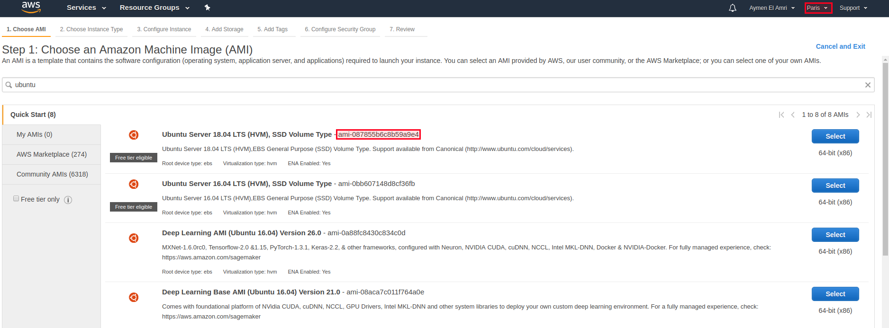
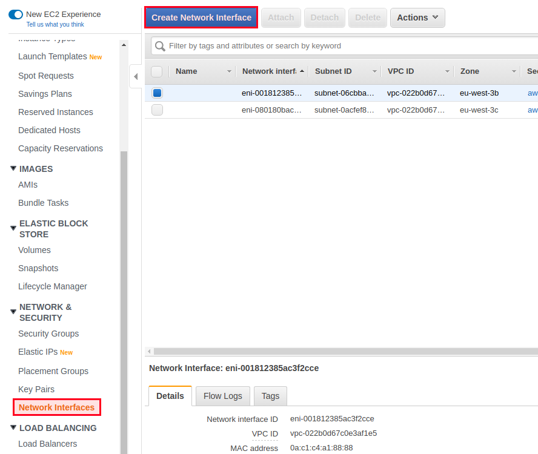

# Lab 3 - Back to The Basics

## Introduction

We have seen together how to create an EC2 machine using the web UI, and we followed some
steps during which we chose the AMI, instance type, tags, security groups ..etc.

In this part, we are going to explain the concepts which we covered in a hurry.

## AMI: Amazon Machine Images

Amazon Machine Image or AMI is a virtual appliance used by AWS to launch a machine. An AMI is
a read-only system that provides some required information to start an EC2 instance. It includes
a template defining the operating system to use, and in addition to that, it can define an
application.

Let's say we would like to use the official 64-bit (x86) Ubuntu 18.04 image on a virtual machine in
Paris. In this case, the AMI we should use is identified by "ami-087855b6c8b59a9e4".



Previously, we installed Nginx on an EC2 using the official Ubuntu AMI, but we can find some
AMIs where Nginx is already installed. We just need to search for it at the moment of choosing
the AMI (first step of creating an EC2 machine):


Some AMIs are paid, and some are free.


If you want to use a free Nginx AMI, make sure that there are no additional fees. In the
screenshot above, using the first AMI will cost you AWS fees + the software fee ($0.03 USD per
hour).

## Instance Types

AWS offers 5 types of EC2 instances:

```
General Purpose
Compute Optimized
Memory Optimized
Accelerated Computing
Storage Optimized
```
You should choose the best for your use case.

### General Purpose:

e.g. A1, T3, T3a, T2, M6g, M5, M5a, M5n, M4

For mainstream applications, these instances are the best choice since they offer a balance of
compute, memory, network capabilities, and cost.

T2 instances are optimized for mid-size websites, web applications,
artifact/development/build/test/staging environments, and microservices.

M4 instances could be used for mid-size databases and data processing applications.

### Compute Optimized:

e.g C5, C5n, C4

Compute optimized instances offers the highest performing processors and the lowest price per
compute performance in EC2.

Compute optimized instances are a good fit for high computational scientific operations,
compute-intensive applications, MMO gaming, batch processing, distributed analytics, high traffic
websites, and video-encoding.

### Memory Optimized

e.g., R5, R5a, R5n, R4, X1e, X1, High Memory, z1d

Memory optimized instances are designed to deliver fast performance for workloads that
process large data sets in memory.

While X1 instances are a good fit for in-memory databases and have the lowest price per GiB of
RAM among Amazon EC2 instance types, R4 instances are a good fit for high
performance/realtime databases, data mining applications, large scale in-memory caches and
Hadoop/Spark clusters.

R4 instances offer better prices per GiB of RAM than R3.

### Accelerated Computing :

e.g P3, P2, Inf1, G4, G3, F1

This type of instance has parallel processing capabilities that give it the ability to host high-
performance databases, large-scale machine learning, and different types of server-side GPU
compute workloads.

While P2 instances are a good fit for general-purpose GPU compute applications, G3 instances
are more optimized for graphics-intensive applications like 3D visualizations, and F1 instances
offer customizable hardware acceleration with field-programmable gate arrays (FPGA) and works
better for real-time video processing, Genomics, analytics and other complex types of computing.

### Storage Optimized

e.g., I3, I3en, D2, H1

I3 and D2 instances are designed for storing and processing data. They offer low-cost storage.

I3 instances have a high I/O performance and are intended to run large NoSQL databases,
Elasticsearch, and in-memory databases.

D1 instances are dense-storage instances and are intended to run MapReduce and Hadoop
distributed computing, distributed file systems, network file systems, or log or data-processing
applications.

## Instance Details

### Number of Instances

Using the step 3 of EC2 creation, you can choose more than 1 instance. If you create 2 or more
instances, they will share things like the network, subnet, IAM role ..etc.


You can request an ordinary instance or a spot one.


### Purchasing Option

EC2 Spot instance allows you to bid on spare Amazon EC2 computing capacity in order to reduce
the cost of your running applications using the same budget. This can save you up to 80-90% of
costs.

This type of instance runs when your bid price exceeds the spot price.

### When to Use Spot Instances

So EC2 spot instance is cheap, but they are not always suitable to use in a production
environment because there are no SLA guaranteed by AWS. This means that if something
happens to a spot instance, it is your responsibility.

However, in some use cases, it is possible to benefit from the advantages that spot instances
offer. Some applications can be fault-tolerant and flexible, like CI/CD, data processing, and
computing back-ends that save data constantly to persistent external storage.

In other words, if you plan to use spot instances, you must have a flexible production architecture
with a fault-tolerant system, which is usually another spot instance, in the same cluster, that treat
the workload when the first one is not responding.

Stateless applications are a good use case. REST APIs are an example of an application that can
be built in a stateless way. Image processing, parallel computing, analytics processing, and big
data are also other suitable uses cases.

Note: An application is stateless when the server side does not store any state about the client
session. Instead, the session data is stored on the client-side and passed to the server when
needed.

Spot instance is not good to run sensitive workloads or databases, but you can use them to
follow this course.

When creating an EC2 instance, you will be able to see the actual spot prices. When the
maximum price per hour for your request exceeds the spot price, Amazon EC2 fulfills your
request if capacity is available.


Note that the prices fluctuate depending on supply and demand, and can vary by region and
availability zone.

### Spot Fleet


A spot fleet is a collection of spot instances. To create one, use: https://console.aws.amazon.com/ec2sp/

It allows to launch a number of spot instance and maintain the target capacity that you specify in
advance. So when a spot instance is interrupted, the fleet will try to launch a replacement.

The spot fleet allows you to decide on certain behaviors of your spot instances. You can, for
instance, decide the default action to do when your maximum price has been exceeded. The
default is to terminate the instance. You can decide just to stop your instance. This will incur
more charges because your spot instances states are saved, but it could be useful in many cases
to choose this behavior over termination. Note that you need to use an EBS-backed AMI to be
able to stop spot instances.

It is also possible to choose other configurations for your fleet like the target capacity to maintain
in term of machines of vCPUs:


It is also possible to decide which instances types, your Amazon EC2 requests your target
capacity from. A good practice here, if you don't have special requirements, is to apply Amazon
recommendations. According to AWS, the more instance types that you specify, the better your
chances of having your target capacity fulfilled.


In the end, you will be able to evaluate your fleet and check its availability and cost:


### Network

When creating an EC2 instance, you can choose which network to use. When you start a VM, you
should choose your Amazon Virtual Private Cloud (VPC). This VPC defines your machines' IP
addresses range, subnets, route tables, network gateways, and other networking configurations.


If you don't choose a VPC, your AWS account comes with a default VPC that will be chosen
automatically.

### Subnet

After choosing your VPC, you will get a list of the available subnets within your VPC, and you can
choose one of them.

A subnet is the range of IP addresses in your VPC that can be used to isolate EC2 resources from
each other or from an external network (e.g., Internet).

Each subnet resides in an availability zone, and an availability zone can not have multiple
subnets. By default, your machine can be in a single subnet, which is the most common use case:
One network interface, one IP address.

A subnet can be public (accessible by anyone) or private (accessible by only those who are
authorized).

### An EC2 Instance / Multiple Subnets

An EC2 machine may have multiple network interfaces or what we call ENI (Elastic Network
Interface).

However, it is not possible all the time. Let's see some examples. Start with this scenario:

We have a VPC with 3 availability zones, which systematically means that you have 3 subnets and
that each subnet has an IPv4 CIDR.

Example:

```
172.31.0.0/20 subnet on eu-west-3a AZ
172.31.16.0/20 subnet on eu-west-3b AZ
172.31.32.0/20 subnet on eu-west-3x AZ
```
_AZ: Availability Zone_

If you create an EC2 machine on the subnet 172.31.0.0/20, the IP address (private or public IP) of
this machine will be attached to a single subnet and a single AZ: "172.31.0.0/20 subnet on eu-
west-3a AZ".

To add a new network interface to the same machine, you should create an ENI, then attach it to
the EC2 machine. If this ENI is on another AZ, it will not be possible to attach it.

Go to your [EC2 console](https://console.aws.amazon.com/ec2/) and create a new ENI.




Make sure to choose the right subnet:


Create the IP and go back to the list of your EC2 instances to attach a new ENI to the instance:


Select the IP address. Congratulations, your EC2 machine has two interfaces and two IP
addresses. If you see an error dialog like the following one, make sure that you created an ENI in
the same AZ of the instance.


### Auto-assign Public IP & Amazon Elastic IP

In order to make your instance accessible from the Internet, you should have a public IP. An
instance in a subnet can not access the Internet unless it has a public IP, and we are talking about
evidence here. Using this option ("auto-assign public IP"), you can request a public IP address
from Amazon's public IP address pool.

The public IP address, in most cases, is attached to the instance until it’s stopped or terminated,
after which it’s no longer available for you to use. So if you create a web server to host your
website and accidentally deleted the instance, you should recreate it, and it will have a new IP
address. You should also reconfigure your domain NS and/or A zones.

This is when EIP (Elastic IP) is helpful. If you need a static IP address that you will always have
even when you terminate or stop your EC2 instance, you should create an instance (without a
default public IP), then create a new EIP, and finally associate the IP to the instance.

The auto-assigned IP can be assigned to only one instance at a time.

If you have an instance in a private subnet and don't want to attach a public IP address to it, you
should add a NAT and assign EIP to it, then modify route tables to allow 0.0.0.0/0 from the private
subnet to go to this NAT. We are going to see this in detail later in this course.


## Adding a Storage

By default, your AWS machine comes with the root volume, usually with /dev/sda1 as the device
name for systems like Ubuntu and /dev/xvda for a system like Amazon Linux...etc

This root volume has 8 GiB, and it's a "General Purpose SSD (GP2)" volume, it comes with 100 /
3000 IOPS, and it will be deleted on the termination of the machine.

Note: IOPS defines the number of I/O operations per second that the volume can support. For
Provisioned IOPS (SSD) volumes, you can provision up to 50 IOPS per GiB. For General Purpose
(SSD) volumes, baseline performance is 3 IOPS per GiB, with a minimum of 100 IOPS and a
maximum of 10000 IOPS. General Purpose (SSD) volumes under 1000 GiB can burst up to 3000
IOPS.

These are the default configuration, but you can change it. For a general-purpose machine, you
can keep these default configurations.

We can also add another volume (EBS or Elastic Block Store) using the block device-mapper, and
it's actually a good practice: Keep the default volume for your operating system and create new
volumes in accordance with what you need.

Let's say we are building an EC2 machine for CI/CD, and we are going to use Docker. Docker users
know that /var/lib/docker can grow fast in size; at the same time, we want to have a backup of
our images. A solution here is creating a second volume; it can be an SSD if you need more
speed, then mounting it to `/var/lib/docker`.


## Configuring Tags

A tag is a key-value pair; for instance, "name": "my_server".

Using tags, you can create different categories of your EC2 machines. Let's imagine a scenario
where you have 100 production machines and 100 development machine, you will see in your
dashboard 200 machines.

Let's say that you shut down all of your development machines at the end of the day and start
them tomorrow.

Without tags, you will probably stop the development machines manually, one by one, but if you
want to do things faster, you can tag all of your development machines with "env": "dev" for
example. After that, all that you have to do is:

```
aws ec2 stop-instances \
--instance-ids \
`aws ec2 describe-instances --filters "Name=tag:env,Values=dev" --query
'Reservations[].Instances[].InstanceId' --output text`
```

Note: The below command is using AWS CLI. The CLI should be installed and configured before
using it.

Let's examine each command apart. The embedded command will list the instance ids having the
tag "env": "dev":

```
aws ec2 describe-instances --filters "Name=tag:env,Values=dev" --query
'Reservations[].Instances[].InstanceId' --output text
```

The second one will simply kill these machines:

```
aws ec2 stop-instances --instance-ids <instance_id_1> <instance_id_2> ..
<instance_id_n>
```

## Adding Security Groups

A security group acts as a firewall. Let's imagine this scenario:

I want to create a web server, I need the port 80 as well as the HTTPS port 443 open to everyone
outside, but I don't need someone else except me access the machine using its SSH port. Since I
have a static IP address, I will allow SSH traffic only from my IP:


The screenshot above shows how to do this. I called my security group "my_security_group", I
gave it a description (optional), and all that I should do to find it later for future use is clicking on
"Review and Launch".
