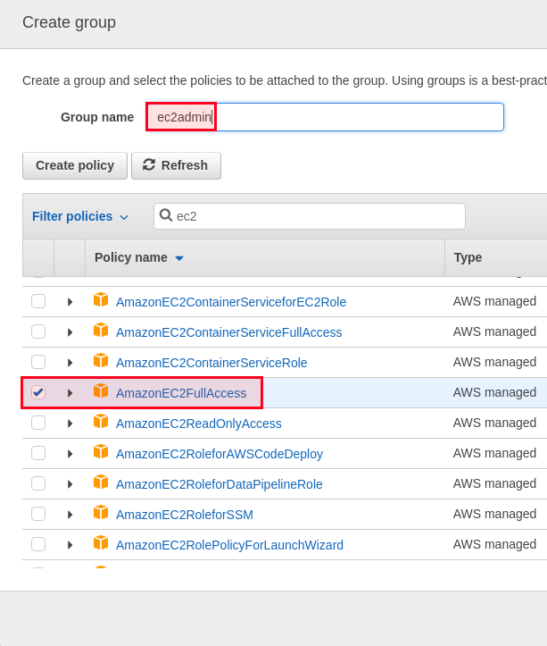

# Lab 4 - Installing And Configuring AWS CLI

## Install the CLI

If you are using Linux or macOS, aws-cli could be installed using pip. You should install Python3 if
it is not already done.

```
sudo apt-get install python-pip
sudo pip install awscli
```

If you want to upgrade aws-cli, run:

```
sudo pip install --upgrade awscli
```

For Mac users, you can follow the same instructions or just download the [tarball](https://pypi.python.org/pypi/awscli), unarchive it and
execute:

```
cd <path_to_awscli>
python setup.py install
```

Windows users should use the appropriate MSI installer:

- AWS CLI MSI installer for Windows (64-bit) : https://s3.amazonaws.com/aws-cli/AWSCLI64.msi
- AWS CLI MSI installer for Windows (32-bit) : https://s3.amazonaws.com/aws-cli/AWSCLI32.msi

Open the installer and follow the instructions.

## Amazon Identity and Access Management

Before moving to configure the CLI, there are some things we should know.

AWS CLI is installed, but you should configure it. Before doing anything, we will need two keys:

- Access key ID
- Secret access key

They are a kind of a login/password that we assign to an IAM user.

Identity and Access Management (IAM) is an Amazon service that enables you to manage access
to AWS services and resources securely, create and manage users and groups, and use
permissions to allow and deny their access to AWS resources.

This is a free service, so whether you create 0 users/groups or 10, there are no fees.

To create a user, open the [IAM console](https://console.aws.amazon.com/iam/home?#home), click on "Users" then click on "Add user".

When you create a new user, you should choose if you need "Programmatic access" or "AWS
Management Console access". It is possible to choose both.

The programmatic access enables the key/secret to use the AWS API, CLI, and SDK as well as the
development tools. AWS management console access, on the other hand, allows the user to
access the AWS management web console.

Let's create a user "learning-aws" with programmatic access.


After confirming the access type, you should give this user access to AWS services and
permissions or deny it from using them.

This can be done using AWS policies. By attaching existing AWS policies to the user, you can set
the user permissions. It is also possible and better in many cases, to create a new group, assign
the p


For instance, if you are going to administer EC2 instances but no other services, you can create
the group "ec2-admin" and attach the "AmazonEC2FullAccess" policy.



If you need a super administrator user, you can create the admin group and add the
"AdministratorAccess" policy.


A policy can be a job type, and this may help in setting up the basic policies then extending them
for your team members, for instance: billing team, support team, data scientists.. etc.

You can filter this and choose the job type using the same group creation interface:


Make sure to choose the right permission policies to guarantee a secure environment.

The user will be automatically added to the group you create.

After creating the user, you will be able to view and download its security credentials. You can
also email users instructions for signing in to the AWS Management Console. This is the last time
these credentials will be available to download. However, you can create new credentials at any
time.

Each user with AWS Management Console access can sign-in at

```
https://<user_id>.signin.aws.amazon.com/console
```

Don't forget to download the .csv file and keep it in a safe place. This file contains the "Access Key
ID" and the "Secret Access Key".

## Configure the CLI

Now that we have both keys "Access Key ID" and "Secret Access Key", we can configure the CLI, so
open your terminal and type `aws configure` in order to configure these settings:

- AWS Access Key ID
- AWS Secret Access Key
- Default region-name
- Default output format

For the region name, choose your favorite one. These are some regions.

| Code        | Name           |
| :------------- |:-------------|
| us-east-1      | US East (N. Virginia) |
| us-east-2   | US East (Ohio)      |
| us-west-1 | US West (N. California)      |
| us-west-2      | US West (Oregon) |
| ca-central-1   | Canada (Central)      |
| eu-west-1 | EU (Ireland)      |
| eu-central-1 |  EU (Frankfurt) | 
| eu-west-2 | EU (London)| 
| ap-northeast-1|  Asia Pacific (Tokyo)| 
| ap-northeast-2 | Asia Pacific (Seoul)| 
| ap-southeast-1|  Asia Pacific (Singapore)| 
| ap-southeast-2|  Asia Pacific (Sydney)| 
| ap-south-1|  Asia Pacific (Mumbai)| 
| sa-east-1|  South America (São Paulo)| 

You can also leave this blank and configure it later.

For the output format, you have the choice between:

- json
- table
- text

## Testing the CLI

In order to test if our CLI is well configured, let's type a command.

If you type:

```
aws ec2 describe-regions
```

You should get the list of regions available to use with EC2 instances.

```
{
   "Regions":[
      {
         "Endpoint":"ec2.eu-north-1.amazonaws.com",
         "RegionName":"eu-north-1",
         "OptInStatus":"opt-in-not-required"
      },
      {
         "Endpoint":"ec2.ap-south-1.amazonaws.com",
         "RegionName":"ap-south-1",
         "OptInStatus":"opt-in-not-required"
      },
      {
         "Endpoint":"ec2.eu-west-3.amazonaws.com",
         "RegionName":"eu-west-3",
         "OptInStatus":"opt-in-not-required"
      },
      {
         "Endpoint":"ec2.eu-west-2.amazonaws.com",
         "RegionName":"eu-west-2",
         "OptInStatus":"opt-in-not-required"
      },
      {
         "Endpoint":"ec2.eu-west-1.amazonaws.com",
         "RegionName":"eu-west-1",
         "OptInStatus":"opt-in-not-required"
      },
      {
         "Endpoint":"ec2.ap-northeast-2.amazonaws.com",
         "RegionName":"ap-northeast-2",
         "OptInStatus":"opt-in-not-required"
      },
      {
         "Endpoint":"ec2.ap-northeast-1.amazonaws.com",
         "RegionName":"ap-northeast-1",
         "OptInStatus":"opt-in-not-required"
      },
      {
         "Endpoint":"ec2.sa-east-1.amazonaws.com",
         "RegionName":"sa-east-1",
         "OptInStatus":"opt-in-not-required"
      },
      {
         "Endpoint":"ec2.ca-central-1.amazonaws.com",
         "RegionName":"ca-central-1",
         "OptInStatus":"opt-in-not-required"
      },
      {
         "Endpoint":"ec2.ap-southeast-1.amazonaws.com",
         "RegionName":"ap-southeast-1",
         "OptInStatus":"opt-in-not-required"
      },
      {
         "Endpoint":"ec2.ap-southeast-2.amazonaws.com",
         "RegionName":"ap-southeast-2",
         "OptInStatus":"opt-in-not-required"
      },
      {
         "Endpoint":"ec2.eu-central-1.amazonaws.com",
         "RegionName":"eu-central-1",
         "OptInStatus":"opt-in-not-required"
      },
      {
         "Endpoint":"ec2.us-east-1.amazonaws.com",
         "RegionName":"us-east-1",
         "OptInStatus":"opt-in-not-required"
      },
      {
         "Endpoint":"ec2.us-east-2.amazonaws.com",
         "RegionName":"us-east-2",
         "OptInStatus":"opt-in-not-required"
      },
      {
         "Endpoint":"ec2.us-west-1.amazonaws.com",
         "RegionName":"us-west-1",
         "OptInStatus":"opt-in-not-required"
      },
      {
         "Endpoint":"ec2.us-west-2.amazonaws.com",
         "RegionName":"us-west-2",
         "OptInStatus":"opt-in-not-required"
      }
   ]
}
```

AWS CLI is installed and configured without problems. If you didn't configure the region, you
could do it now since you have the updated list of regions. Type aws configure and leave
everything as it is by hitting the enter button, configure the region, then confirm the new settings.
