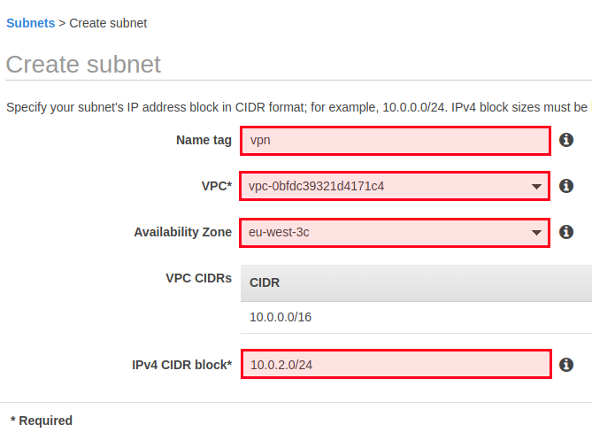

# Lab 5 - AWS Networking

## Introduction

In this lesson, we are going to learn how to configure your AWS network. We are going to create :

- A VPC (Virtual Private Cloud)
- Private and Public Subnets
- Route Tables
- An Internet Gateway
- A NAT Gateway

VPC acts as network isolation for your computing, storage, and other resources you use. All
resources that belong to a VPC are logically isolated and launched inside an isolated virtual
network. In a VPC network, we have sub-networks (subnets).

Subnetting has many benefits. In a large network with no subnets, every server would see
broadcast packets from all the servers and users on the network, resulting in the switches having
to move all that traffic to the appropriate ports. It also allows for easier administration and
growth control. It helps in boosting security; for instance, it is more secure to create a private
subnet for the machines that we don't need to expose to the Internet.

Note: A machine in a private subnet, even without being public, can access to the Internet. This is
possible using the NAT gateway (Network Address Translation). When a private-addressed
machine sends or receive traffic, it will use the NAT gateway without even having a public IP
address.

So, each private subnet should have its own NAT gateway in order to allow external access. Even
if we don't need access to the Internet in most cases, using APT or YUM package managers to
install and upgrade your system packages, need Internet access.

## Internet Gateway vs. NAT Gateway

Let's try to understand the difference between these gateways. They both allow instances to have
external access (Internet), and this may be confusing to understand the real difference.

The first thing and the main difference is that the Internet Gateway (IGW) is attached or allocated
to a VPC while a NAT Gateway (NGW) is associated with a subnet in the VPC. A VPC can have
multiple subnets, therefore multiple IGW; however, it can not have more than 1 IGW.

There is also another difference: The IGW gives your VPC external access and the NAT gateway
routes to an IGW to access the internet. So even if a subnet has a NGW, it will be unable to reach
external hosts if the VPC does not have an IGW.

Another difference resides in the fact that IGW is nothing then a logical link to the Internet. It is
like your RJ45 cable, it allows your home to have external access, but there is no control.
However, the NGW is a machine; consider it like your home switch that you can control to
open/close ports, block web sites ..etc.

Historically, the NGW was not a managed service, you should create your own EC2 machine, but
now when you create a NAT Gateway, logically, AWS creates a managed VM for you. In all cases,
now the NGW is a managed service. To create a NGW, you should assign an Elastic IP address to
it. The routing mechanism of a NGW is done using Route Tables.


## Creating a VPC

To understand all of this, the best and the most common example I found is the following:


_source: aws.amazon.com_

**Important Note** : The network we are building follows the same diagram but may uses different
IP addresses VPC, subnets, CIDRs..etc

Let's start by creating a new VPC. You can delete the default VPC and if you want to recreate it
later, use the "Create Default VPC" menu.


Click on "Create VPC"


Give the VPC a name. I name it "custom".

Provide the IPv4 CIDR block; I used `"10.0.0.0/16"` which means that I will have the ability to use all
the blocks between 10.0.0.0 and 10.0.255.255, which contains 65536 IP addresses.

I do not need a dedicated VPC; the default tenancy once is good for most use cases.


Let's move to create two subnets; one public and one private subnet.


The first public subnet has the name "public"; you can choose another name. I also assign it to
the AZ "eu-west-3a". If you are using another region, you can choose a different zone. Finally, for
the IP addresses block, it ranges from 10.0.0.0 to 10.0.0.255, which means 256 addresses, and it
is enough for most uses cases. Unless you are going to deploy more than 256 machines in this
subnet, you can choose another block.

Do the same thing to create another private subnet.


We are using the CIDR 10.0.1.0/24, and this is a random choice, you can choose another CIDR, but
since the first subnet has the CIDR 10.0.0.0/24, why not choosing the next CIDR 10.0.1.0/24.

After creating two subnets, we can notice that both are using the same route table, and it is the
default route table created by AWS.


You can click on it and rename it to "default", to avoid any confusion.


Now, let's create a second route table, which will act as the private route table in our
infrastructure.


The third route table will be the public one.


Now, at this step, we have two subnets (1 private and 1 public), two route tables (+ the default
one), and we need an Internet Gateway.


Create one, give a name tag, and attach it to the VPC.


Let's associate the public subnet to the public route table.


Click on "Edit subnet associations" and choose the public subnet from the list.


Any EC2 instance in the public subnet should be able to send and receive traffic from the
Internet, and this is why the route table should allow the subnet to reach and receive traffic from
all hosts (0.0.0.0/0).

To make this happen, click on "Routes", then "Edit routes".


Add "0.0.0.0/0" as destination and the Internet Gateway we created as the target.


This means that if an EC2 machine in the public subnet wants to ping google, the VPC will check
its route table before and find that it can reach the Internet using the line we added to the route
table, which means that the traffic will flow through the Internet Gateway. The reverse traffic will
also flow through the Internet Gateway, then the router, and finally reach the EC2 machine.


**Important Note** : The network we are building follows the same diagram but may uses different
IP addresses VPC, subnets, CIDRs..etc

Now, go to the private route table and associate the private subnet to it.


Since the private subnet or the hosts in the private subnet need to access the Internet while
keeping them private (not reachable from the outside), we need to create a NAT Gateway.


Create a new NAT Gateway, choose the public subnet, and create a new EIP (Elastic IP).

Note: When creating a NAT Gateway, keep in mind two things: It should be on the public subnet,
even if we are going to use it with the private subnet. It should have an EIP.

No go back to the route tables and edit the private subnet. We need to tell the VPC (more exactly
the private subnet route table), that any outgoing traffic requested by an instance in the private
subnet and going out to the Internet should transit through the NAT Gateway.


Edit the routes. As a destination, use "0.0.0.0/0" and, as a target, use the NAT Gateway.


So, any traffic outgoing traffic from the private subnet will check the route table and sees that it
should go through the NAT Gateway. The NAT Gateway will also check the route table of the
public subnet (because it is in the public subnet) and finds out that in order to send outgoing
traffic, it should use the Internet Gateway.

Private EC2 -> Router -> NAT Gateway -> Router -> Internet Gateway.

So, if you were asking this question:

If the NAT Gateway is used with the private subnet and not the public one, why is it in the public
subnet?

The answer is:

Exactly, the private subnet uses the NAT Gateway. The public subnet makes no use of the NAT
Gateway. However, since the NAT Gateway should have access to the Internet, it should be in the
public subnet.


**Important Note** : The network we are building follows the same diagram but may uses different
IP addresses VPC, subnets, CIDRs..etc


Now, if you create an EC2 machine on the public subnet, it will be able to send and receive
outbound and inbound traffic. However, the machines in the private subnet will only be able to
send outbound traffic. In case we need to ssh into these machines, a solution would be creating a
bastion host in the public subnet and use it as an entry point to any machine in the private
subnet.

If you want to create a bastion host, you can also deactivate the SSH access to 0.0.0.0/0 in the
security group of public hosts and only allow the bastion IP address.

So, the bastion host can be a way to harden security, allowing SSH access to all machines (public
and private) only through it.

The second solution is creating a VPN.

## Using a VPN

Create a new subnet for the VPN machine. We will use a different zone here (eu-west-3c).



Now, since the VPN should be accessible from our machines, or any other machine, we should
associate the public route table to the VPN subnet.


To create a VPN, the most common choice is OpenVPN, let's create an EC2 machine in the VPN
subnet and install OpenVPN, then configure it.

You can choose the OpenVPN instance from the AWS Marketplace since we will have a ready-to-
use instance of OpenVPN.

I recommend using the free tier eligible AMI.


In the instance configuration step, choose the "custom" VPC we created previously, use the "vpn"
subnet, and we don't need to assign a public IP at this step.

Public IPs are ephemeral, if we stop or shut down the instance, the IP address will be released,
and we will not be able to use it. So if you are using the VPN for a production setup, disable the
public IP, we are going to attach an EIP later. Note; As we have seen, EIP is a static IP address. It
will not change when we shutdown our VPN instance.


If you are using the VPN to test, choose to auto-assign a public IP.

If you didn't choose to assign a public IP, when the instance is created, go "Elastic IPs" and create
a new one.


Now, go to "Network Interfaces" and associate the EIP to the network interface of the VPN machine.


Now, you will be able to SSH into the OpenVPN machine using:

```
ssh -i "aws-tutorial.pem" openvpnas@15.188.64.165
```

If you did choose to assign a public IP, use the auto assigned IP.

Make sure to use "openvpnas" as a username and use the EIP with the key you chose previously
when creating the machine.

If you created the EC2 machine using the same OpenVPN AMI that I created, when you will ssh
into the machine, you would be asked to configure OpenVPN. Choose the default settings, except
the username and choose "vpnadmin" as a username or something different from "openvpn"
then set the password.


At the end of the configuration, OpenVPN will give you the IP address to access the admin
dashboard.

If you want to reconfigure OpenVPN, use:

```
sudo /usr/local/openvpn_as/bin/ovpn-init
```

Then, you will need to change/set password for openvpc user. Type this code to do it.

```
sudo passwd openvpn

---
Enter new UNIX password: 
Retype new UNIX password: 
passwd: password updated successfully
```

To download an OpenVPN client, visit the client page using the same address but without
"/admin".

```
https://15.188.64.165:943
```

Probably, you will see authentification menu. You need to put login as `vpnadmin` (or another you've set in configuration step before) and a password we've set for openvpc user. 

If it didn't work, try to enter the same password and login `vpnadmin`. If it didn't work to, reconfigure openvpn and leave default user. To remove all previous configuration file use `--force` or `-forse` paramether

```
sudo /usr/local/openvpn_as/bin/ovpn-init -forse
```

Click on your OS, and you will be able to read the official documentation. 


Download your
OpenVPN client, then go back to the same page and to download the "client.ovpn" file, click on
your profile:


The file we downloaded helps in connecting your laptop to the VPN.

In Ubuntu, for example, install the package "openvpn" then:

```
openvpn3 session-stats --config client.ovpn
```

Now, to test if I can access EC2 private machine from my laptop, I created a machine on the
private subnet:


Then using my laptop (after connecting to the VPN), I pinged the private IP of the machine:

So, if I can ping a machine with a private IP address, I'm sure that my OpenVPN settings work. You
can do the same to test.

```
ping 10.0.1.39


PING 10.0.1.39 (10.0.1.39) 56(84) bytes of data.
64 bytes from 10.0.1.39: icmp_seq=1 ttl=63 time=7.00 ms
64 bytes from 10.0.1.39: icmp_seq=2 ttl=63 time=10.8 ms
64 bytes from 10.0.1.39: icmp_seq=3 ttl=63 time=8.88 ms
64 bytes from 10.0.1.39: icmp_seq=4 ttl=63 time=10.7 ms
64 bytes from 10.0.1.39: icmp_seq=5 ttl=63 time=9.26 ms
64 bytes from 10.0.1.39: icmp_seq=6 ttl=63 time=8.14 ms
64 bytes from 10.0.1.39: icmp_seq=7 ttl=63 time=7.13 ms
64 bytes from 10.0.1.39: icmp_seq=8 ttl=63 time=9.38 ms
64 bytes from 10.0.1.39: icmp_seq=9 ttl=63 time=7.84 ms
64 bytes from 10.0.1.39: icmp_seq=10 ttl=63 time=9.87 ms
64 bytes from 10.0.1.39: icmp_seq=11 ttl=63 time=7.52 ms
64 bytes from 10.0.1.39: icmp_seq=12 ttl=63 time=10.4 ms
64 bytes from 10.0.1.39: icmp_seq=13 ttl=63 time=8.75 ms
```

## Get more about DNS and Route53 Record Types **(optional)**

### Route53 introduction

Amazon Route 53 is a highly available and scalable cloud [Domain Name System (DNS)](https://aws.amazon.com/route53/what-is-dns/) web service. It is designed to give developers and businesses an extremely reliable and cost effective way to route end users to Internet applications by translating names like www.example.com into the numeric IP addresses like 192.0.2.1 that computers use to connect to each other. Amazon Route 53 is fully compliant with IPv6 as well.

Amazon Route 53 effectively connects user requests to infrastructure running in AWS – such as Amazon EC2 instances, Elastic Load Balancing load balancers, or Amazon S3 buckets – and can also be used to route users to infrastructure outside of AWS. You can use Amazon Route 53 to configure DNS health checks to route traffic to healthy endpoints or to independently monitor the health of your application and its endpoints. Amazon Route 53 Traffic Flow makes it easy for you to manage traffic globally through a variety of routing types, including Latency Based Routing, Geo DNS, Geoproximity, and Weighted Round Robin—all of which can be combined with DNS Failover in order to enable a variety of low-latency, fault-tolerant architectures. Using Amazon Route 53 Traffic Flow’s simple visual editor, you can easily manage how your end-users are routed to your application’s endpoints—whether in a single AWS region or distributed around the globe. Amazon Route 53 also offers Domain Name Registration – you can purchase and manage domain names such as example.com and Amazon Route 53 will automatically configure DNS settings for your domains.

[Video presentation](https://www.youtube.com/watch?v=RGWgfhZByAI&ab_channel=AmazonWebServices)

_source: https://aws.amazon.com/route53/_

### Route53 Record Types

Route53 supports different record types:

- **A Record Type** The value for an A record is an IPv4 address
- **AAAA Record Type** The value for a AAAA record is an IPv6 address
- **CAA Record Type** CAA is the acronym of Certification Authority Authorization. This record is
used to specify which certificate authorities are allowed to issue certificates for a domain.
- **CNAME Record Type CNAME** is the acronym of the Canonical Name record. It is a type of
resource record in the DNS (Domain Name System), and it is used to specify that a domain
name is an alias for another domain
- **MX Record Type** According to Wikipedia,

> A mail exchanger record (MX record) is a type of resource record in the Domain Name System
that specifies a mail server responsible for accepting email messages on behalf of a recipient’s
domain and a preference value used to prioritize mail delivery if multiple mail servers are
available. For example, to use Google G Suite, you should configure your MX records with the
following configuration:
```
ASPMX.L.GOOGLE.COM 1
ALT1.ASPMX.L.GOOGLE.COM 5
ALT2.ASPMX.L.GOOGLE.COM 5
ALT3.ASPMX.L.GOOGLE.COM 10
ALT4.ASPMX.L.GOOGLE.COM 10
```
> 1, 5, and 10 are the different priorities to give to each of the MX servers.

- **NAPTR Record Type** APTR ( Name Authority Pointer) records are often used for applications
in Internet telephony, NAPTR records are most commonly used with SIP protocol in
conjunction with SRV records.
- **NS Record Type** The NS (Name Server) identifies the name servers for the hosted zone. NS
indicates which DNS server is authoritative for a given domain.
- **PTR Record Type** PTR (Pointer records ) associates an IP with a domain name. For instance,
it could be used to to make 192.168.0.1 resolve to http://www.my-domain.com.
- **SOA Record Type** A start of authority (SOA) record provides information about a domain
and the corresponding Amazon Route 53 hosted zone. Every domain must have a Start of
Authority record.

SOA includes different information that you can find here.


- **SPF Record Type SPF** (Sender Policy Framework) is a simple email-validation system
designed to detect email spoofing. This is deprecated.

RFC 7208, Sender Policy Framework (SPF) for Authorizing Use of Domains in Email, Version 1, has
been updated to say, “...[I]ts existence and mechanism defined in [RFC4408] have led to some
interoperability issues. Accordingly, its use is no longer appropriate for SPF version 1;
implementations are not to use it.”

Now it is recommended to create a TXT record that contains the applicable value instead of using
this type.

Example:

```
"v=spf1 include:amazonses.com ~all"
```

Read [how to use TXT records with DKIM, SPF, and DMARC](https://startupsventurecapital.com/why-your-marketing-email-will-land-in-my-spam-folder-the-non-marketing-guide-dkim-spf-dmarc-43f91f9c6940).

- **SRV Record Type** SRV (Service Record) defines the location, like the hostname and port
number, of servers for specified services. The first three values are decimal numbers
representing priority, weight, and port.

e.g :

```
1 2 80 my-hostname.m-domaine.com
```

- **TXT Record Type** TXT (Text Record) is a type of record used to let system administrators
associate arbitrary text with a host. It is most commonly used with services and protocols
like SPF, DKIM, DMARC, and DNS-SD ..etc.
