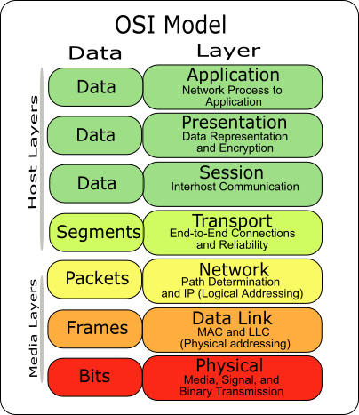
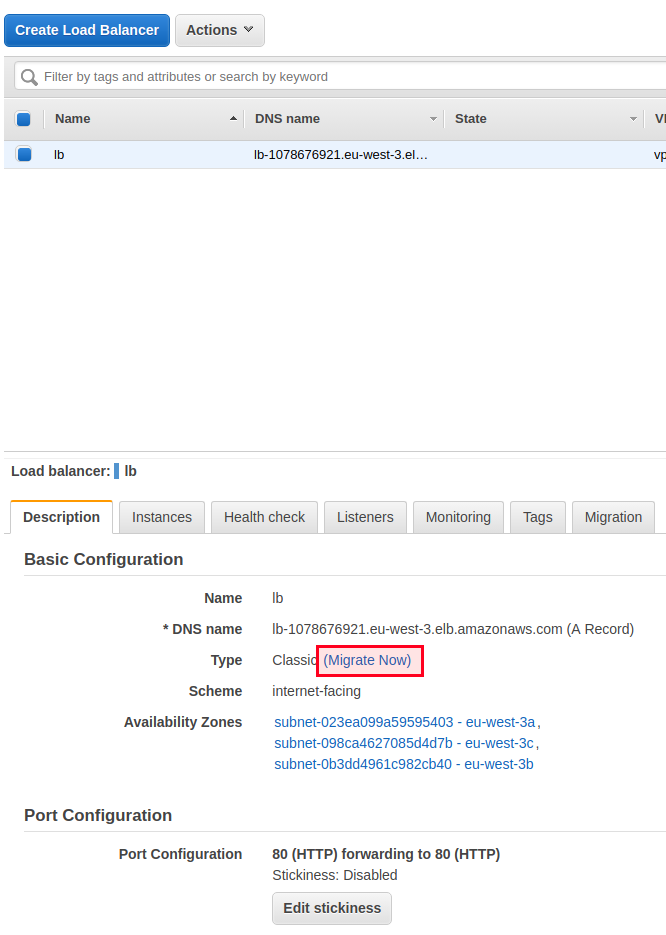

# Lab 6 - AWS Load Balancers

There are 3 types of load balancers. It may be confusing if this is the first time you use ELB
(Elastic Load Balancer), and this is why we are going to study the differences between these 3
types.

We will make a choice to use the Classic Load Balancer (which is the old type of AWS load
balancer) to show how to migrate from the old one to the Application Load Balancer. If you are
using the VPC-EC2 instances, use the Application Load Balancer and don't follow the migration
guide.

# How Elastic Load Balancer Works

Load balancers are one of the most used infrastructure components, especially in medium to
high traffic production environments. Basically, a load balancer acts as a reverse proxy and
distributes network or application traffic across a pool of servers.

Load balancers are used for two main reasons. First of all, an application, especially if it is
distributed, runs across multiple servers. Even in the traditional two-tier and three-tier
architectures, your application always has frontend servers and backend servers.

In order to make these servers more resilient, there are two solutions mainly:

- Horizontal scaling
- Vertical scaling

While horizontal scaling means that you scale by adding more machines into your pool, vertical
scaling is about adding more power (e.g., RAM) to an existing machine.

If you are running out of RAM or CPU, vertical scaling will solve your performance problem but
not the availability of your application. If you decide that your API services, as an example, should
have a server with 16GB of RAM, and even if you feed it with 32GB, there is no guarantee that a
system problem occurs, and the machine goes down. This is when the horizontal scaling
guaranteed both performance and uptime.

If you scale your API to 10 servers, it would be silly, too, if you allocate 10 public static IPs and use
them in production. By adding a reverse proxy with load balancing capabilities, you will be able to
have a single static public IP and use the capacity of all of your scaled pool.

Load balancers, in general, follow load balancing algorithms, like

- Round Robin (or "Next in Loop")
- Weighted Round Robin
- Source IP hash
- URL hash
- Least connections
- Weighted least connections.
- Random

AWS load balancers implement some of these algorithms; we are going to see this later.

To summarize, load balancers are reverse proxy with load balancing capabilities. They are useful
to increase the performance and uptime of a pool of servers running the same application. They
follow load balancing algorithms. ELB is the managed load balancer of AWS.

## Application Load Balancers

The first type of load balancer that AWS offers as a managed service is the Application Load
Balancer.

This type of ELB acts at the HTTPS/HTTPS levels, which is the application layer.

Let's get back to some networking basics; HTTP(S) like FTP, IRC, SSH, and DNS are at the 7th layer
of the OSI model. It makes routing based on the HTTP(S) path. In other words, if you have a
website with two routes `"website.com/path1"` and `"webstite.com/path2"`, the layer 7 load
balancer can redirect the first request to a server or pool of servers, and the second path to
another one. This is how the application load balancer or the 7th layer load balancer works.

_source: wikimedia.org_

So Application LB supports path-based routing and can route your requests to one or more ports
on each instance in your cluster. You can't do this with a layer 3 or 4 load balancer.

We say that the Applications Load Balancer is "context-aware". Another common use case for ALB
is redirecting HTTP to HTTPS-based upon rules, like hosts and paths. The Application Load uses
the "X-forwarded-for" header containing the client IP address; this is not something we can do
with other types of Load Balancers.

The Application Load Balancers are commonly used with microservices and containers.

## Network Load Balancers

Network Load Balancer has an ultra-high performance. It supports TLS offloading at scale,
centralized certificate deployment, support for UDP, and static IP addresses.

The Network Load Balancer operates at levels 3 and 4 of the OSI model and is not aware of
higher-level protocols like HTTP/HTTPS. Since Network Load Balancers operates at lower levels,
they are capable of handling millions of requests per second and securely maintaining low
latency.

This type of load balancers is "context-less", and only care about the network packets and the
information contained in these packets.

If you are not familiar with the OSI model, the types of data each layer uses.

## Classic Load Balancers

In May 2009, Amazon introduced Elastic Load Balancing (ELB), Auto Scaling (which allows users to
scale policies driven by metrics collected by Amazon CloudWatch), and Amazon CloudWatch (to
track per-instance performance metrics like CPU load). The Application Load Balancer (ALB) was
introduced later, and the first one was renamed Class Load Balancer, and it is still available to
use.

Elastic Load Balancers are used with different AWS services, including EC2. To understand why
Classic Load Balancers are "classic", we must understand that there two types of EC2 instances;
EC2-Classic or EC2-VPC.

EC2-Classic is the first and original release of Amazon EC2. Instances run in a single, flat network
that is shared with other customers. However, EC2-VPC instances run in a VPC that is logically
isolated to only one AWS account.

So if you have existing applications running in the EC2-Classic network, you should choose the
Classic Load Balancer, otherwise choose the Network Load Balancer if you want network load
balancing and Application Load Balancing if you need HTTP(S)-aware load balancing.

Note that you can use the Classic Load Balancer with EC2-VPC instances.

Both CLB and ALB supports features like sticky sessions, backend authentication and encryption,
health checks, CloudWatch and autoscaling, access logs, connection draining, and cross-zone
load balancing. However, only ALB supports WebSockets, HTTP/2, path-based routing, and
routing to multiple ports of a single instance.

## Migrating From Classic Load Balancer to Application Load Balancer

Migrating to ALB is easy; do not expect more than a few minutes to do it. There are 3 ways official
ways to migrate a CLB to an ALB, the first one is creating a new EC2 instances pool and a new
load balancer. The second way is using the migration wizard.

You will be asked to verify the configurations, once you click on "create", the migration will start.